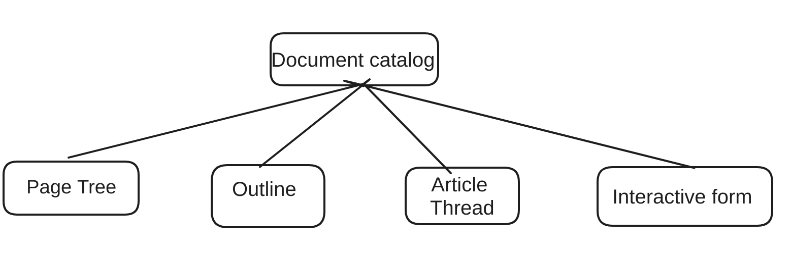
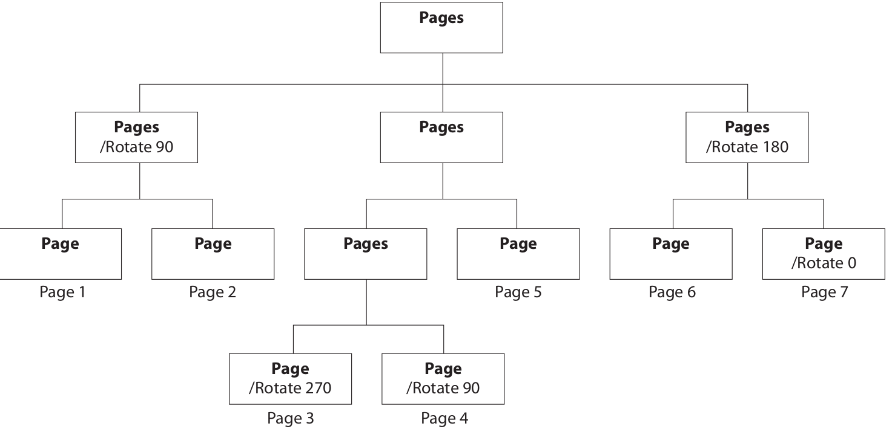

+++
title = "PDF 文件结构-Document Strcture (三) "
description = "PDF 文件结构"
date = 2024-05-06
updated = 2024-05-06
draft = false

[taxonomies]
tags = ["PDF"]
[extra]
math = true
math_auto_render = true
keywords = "PDF"
toc = true
series = "PDF"
+++

## PDF Document Structure 
PDF 可以看作是[上一章](https://rockyzhengwu.github.io/pdf-file-structure/)  中介绍的 Dictionary 组成的一个树形的层次结构，比如的一层的部分是下图中的样子

PDF 中的每一页都是一个Dictionary 来描述，这个 Dictionary 有 Page 中内容对象的引用，这一页上的注解，页面大小等等都可以在这个 Dictionary 中描述，所有的页都是 Page Tree 中的叶子节点，也有非页节点，而且叶子节点可以从父节点继承一些属性。比如页面大小。

### Document Catalog

Document Catalog 是 PDF 文档结构的根节点，这个根节点存在 trailer 中的 Root 里。从 Document Catalog 我们可以得到 PageTree 的根节点，然后解析 PageTree 解可以知道每一页的内容。Outline 等其他信息也是类似的流程。

### Page Tree
文档结构中重点介绍一下 Page Tree ，因为 PDF 的主要主要内容都是存储在 Page 里面。
Page Tree 是一个树结构，其中也两种节点，没个节点都是一个 Dictionary, Dictionary 中有一个字段 Type ， Type 中有 Pages,和 Page 两种取值。Pages 是 Page 的集合，它们多是在非叶子节点上，Page 多是叶子节点，大致结构类似下图:

Page Tree 的解析过程可以参考 [rspdf 的实现](https://github.com/rockyzhengwu/rspdf/blob/main/pdf/src/pagetree.rs), 

#### Content Stream
这是知道了页面的结构，需要知道每一页的内容，PageTree 中 Page 类型的节点中有一个 `contents`的字段存储当前页面的内容的引用，内容多是存储在一个 Stream 类型里。解析 Content Stream 中的指令，通过一个基于 Stack 的解释器解释这些指令就能得到具体的位置上是图片还是文字等等信息。

#### Resource Stream

每一页的内容有文字，文字有字体，字体这种就被当作资源存储在 Page 节点的属性里，当我们解释 Content Stream 的指令的时候，指令的操作是设置当前字体, 然后从 Resource 中可以获取到具体的字体是什么。除此之外图片，颜色等信息都可以在 Resource 里面.

从 Document Structure 结构我们可以知道 PDF 一些元素的逻辑解构，结合[上一章 File Structure ](https://rockyzhengwu.github.io/pdf-file-structure/) 可以很好的从 PDF 中抽取一些数据，比如提取嵌入在 PDF 中的字体，这都不要我们具体去实现解释器，解释 Content  的内容.
当然 Document Structure 中还有其他内容没有在这里展开，比如 Form 相关的.
