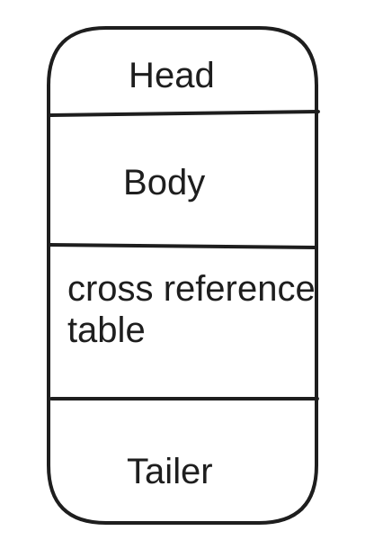

+++
title = "PDF 文件结构 File Structure(二) "
description = "PDF 文件结构"
date = 2024-01-02
updated = 2024-01-02
draft = false

[taxonomies]
tags = ["PDF"]
[extra]
math = true
math_auto_render = true
keywords = "PDF"
toc = true
series = "PDF"
+++

## PDF File Structure
[PDF 文件结构(一)](http://127.0.0.1:1111/pdf-overview/)

从大的角度 PDF 可以分成下图中的四个部分.

[](./pdf_file_structure.png)

###  Head 
 Head 一般都只有很少的信息，比如最简单的 `%PDF-1.7` 这样一行，记录 PDF 版本.

### Body
通常情况下 Body 占了 PDF 文件的几乎 95% 以上的内容，Body 是很多 Object 组成的。

### Cross reference table
Cross reference table 记录 所有 Object 在文件中的位置信息。

### Trailer
Trailer 中有两部分，一部分是一个 Dictionary 记录了一些基础的信息，比如 PDF 的Info, 加密信息，比较重要的是记录的 Document Structure 的 Root ， 后面还会提到这个。领一部分是记录 cross reference table 的起始位置,下面是一个 Trailer 的示例

```
Trailer
<<
key1, value1
key2, value2
...
>>
startxref
int(这个 int 记录 cross reference table 的位置)
%EOF

```


开始解析 PDF 的时候大致可以分 下面几个步骤
1. 从文件读取 Trailer 中的信息
2. 从 Trailer 获取 cross reference table 的位置开始解析 cross reference table
3. 从 trailer 获取 Document Structure 的 跟节点 开始解析出文档结构的信息。

这里有 File Structure 和 Document Structure 两个概念，File Structure 是文件的物理结构信息，Document Structure 是文档逻辑结构，比如每页的位置，每一页也是很多 Object 组成的。

### Objects
在读 Trailer 和解析 cross reference table 我们需要知道 PDF 都有哪些 Objects, 他们的解析的方法是什么。Trailer 又一个 Dictionary, Dictionary 就是一种 PDF 支持的 Objects, Cross reference Table 因为版本的原因有两种方式，其中最新的版本就是 Objects 组成的。

PDF  是从 PostScript 演化来的，Objects 也就类似我们变成语言中支持的数据类型

#### Boolean Objects
Boolean 就两种 true, false,

#### Numeric Objects
数值类型有两种，一种是整数(Integer objects),一种是实数(Real objects),我想这里指浮点数。下面这些都是数值类型的写法

```
123 43445 +17 -98 0 34.5 -3.62 +123.6 4. -.002 0.0
```

### String Objects
String 也有两种，一种是 Literal String 这种是在小括号中的字符串组成，比如:
```
( This is a string )
```

另一种是 Hexadecimal String 从字面意思可以看到这种字符串是16 进制的，放在两个尖括号里面, 比如
```
< 4E6F762073686D6F7A206B6120706F702E >
```

当然字符串有其他许多规则，比如 Literal String 里面有特殊符号怎么办之类的.

### Name Objects

Name Objects 用 `/` 开头后面跟字符串表示比如:
```
\Root
```

### Array Objects

Array 是一种符合结构，和 Python 的 List 一样里面可以是任何 PDF Objects 包括 Array 本身,定义在中括号里，比如下面这个 Array 有两个数值，一个 Bool, 一个 String, 和一个 Name.
```
[ 549 3.14 false ( Ralph ) /SomeName ]
```

### Dictionary Objects
Dictionary 是一组 Key 和 value ，类似变成语言中的 Map, 语法定义是在两个`<<` 和 `>>` 之间, key 都是 Name 类型，Value 可以是任何 PDF Objects 包括 Dictionary.
```
<< /Type /Example
  /Subtype /DictionaryExample
  /Version 0 . 01
  /IntegerItem 12
  /StringItem ( a string )
  /Subdictionary << /Item1 0 . 4
    /Item2 true
    /LastItem ( not ! )
    /VeryLastItem ( OK )
  >>
>>
```

### Stream Objects
Stream 包含两部分，一部分是一个 Dictionary ，另一部分是二进制流，是 Stream 的内容。Stream 是很常见的对象，比如表示图片的时候，Dictionary保存图片的信息，宽高等，Stream 保存图片的具体内容，语法的大体如下, stream 和 endstream 是关键字，中间的部分就是stream 具体内容
```
dictionary
stream
… Zero or more bytes …
endstream
```

### Null Object
Null 和变成语言中的 None 一样

### Indirect Objects 
Indirect Objects 是一中特使的类型，可以理解它是 Objects 的一种引用，比如在一个 Dictionary 的 Value 是一个 Stream ， 由于 Stream 通常很大等因素,不太好把这个 Stream 写到这个 Dictionary 当前位置，我们就可以把 Stream 保存到其他位置，然后把这个 Stream 在 cross reference table 中的编号存成 Dictionary 的Value。 读到这个 Indirect Objects 我们可以去 cross reference table 中找到具体位置然后解析这个 Stream。

前面实现一个 PDF 阅读器之前，需要实现这些这些 PDF Objects 的解析规则，具体的实现可以参考我用 Rust 实现的 PDF 阅读器的Parser 部分 [rspdf](https://github.com/rockyzhengwu/rspdf/tree/main/pdf/src/parser)


