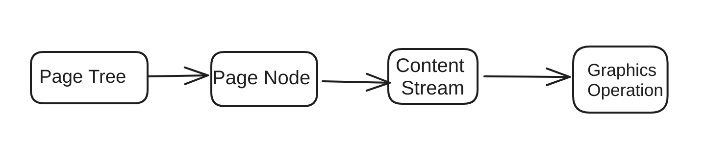

+++
title = "PDF 文件结构-Graphics(四) "
description = "PDF 文件结构"
date = 2024-01-02
updated = 2024-01-02
draft = false

[taxonomies]
tags = ["PDF"]
[extra]
math = true
math_auto_render = true
keywords = "PDF"
toc = true
series = "PDF"
+++

## Graphics
根据 [File Structure](https://rockyzhengwu.github.io/pdf-file-structure/) 和 [Document Structure](https://rockyzhengwu.github.io/pdf-document-structure/) 两部分知识，可以解析出每页的 Content Stream，我们最终看到的 PDF 是光栅化之后的结果，每一页的 Content Stream 是一些指令组成的，通过基于 Stack 的解释器，可以把这些指令转换成 Graphic 操作，Graphics 操作定义了页面上的 Graphics Object 。我们看到的,文本，图片，等等都是 Graphic Objects。这张主要介绍 Content 转化成 Graphics 的大的逻辑.

[](./graphics_flow.png)

## Graphics Objects
PDF 有 5 种大的 Graphic 类型
- Path object: 直线，四边形，贝塞尔曲线组成的任何图形.
- Text Object: 简单理解就是我们看到的文本.需要字体，颜色等结合来定义一个文字怎么显示.
- External Object: 在 Content Stream 作为引用存在，实际在每一页的 Resource Dictionary 中.
- inline Image: 在 Content Stream 中直接存在的图像
- Shading Object: 一个几何图形，他的颜色是用任意位置的函数定义的。

## Graphics Operation 
下面是一个 Content Stream 的例子，`q`,`ri`,`gs` ... `TJ` 都是具体的 Graphics Operation, Operation 前面的部分就是 Operation 的参数。比如 `/F6 1 Tf` 这行就是设置字体是 `F6`, 字体大小是 `1` 。

```
q
/RelativeColorimetric ri
/GS2 gs
BT
/F6 1 Tf
11.9299 0 0 11.9299 111.5607 411.2903 Tm
/Cs8 cs 1 scn
0.0001 Tc
0 Tw
[(T)104.6(o)-267.6(my)-267.8(kind,)-267.1(brilliant,)-268.7(and)-267.5(inspiring)-267.2(Sara.)]TJ
ET
Q

```
Operation 的解释是一个基于 Stack 解释器，Stack 中存储的是 Graphic State。Operation 按照产生的结果可以分成两种，一种是设置 Graphic State，比如例子中的 `Tf`设置字体信息,还有一种是产生具体的 Graphics 比如 `TJ`, `TJ` 的作用是在页面上显示文本.

通过 [Content Stream 的解析器](https://github.com/rockyzhengwu/rspdf/blob/main/pdf/src/page/content_parser.rs) 可以得到 Grapic Operation, 但是具体的每个 Operation 产生什么作用可以在后面的章节详细介绍。


