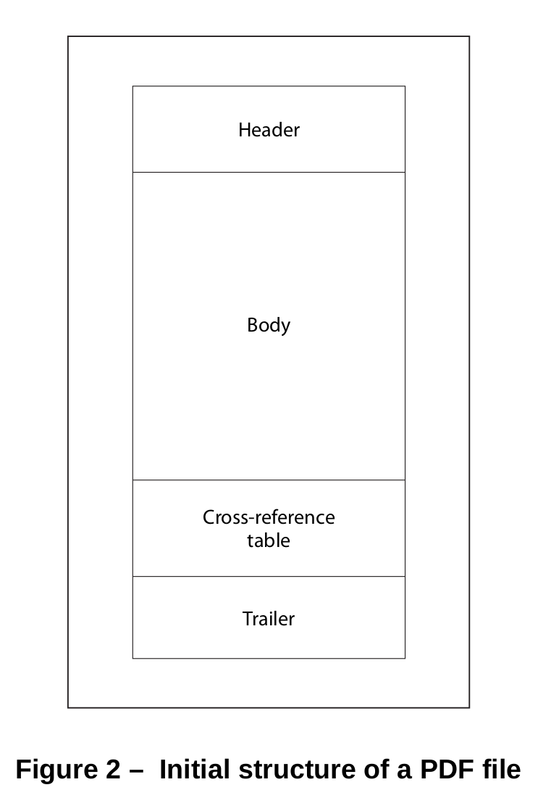
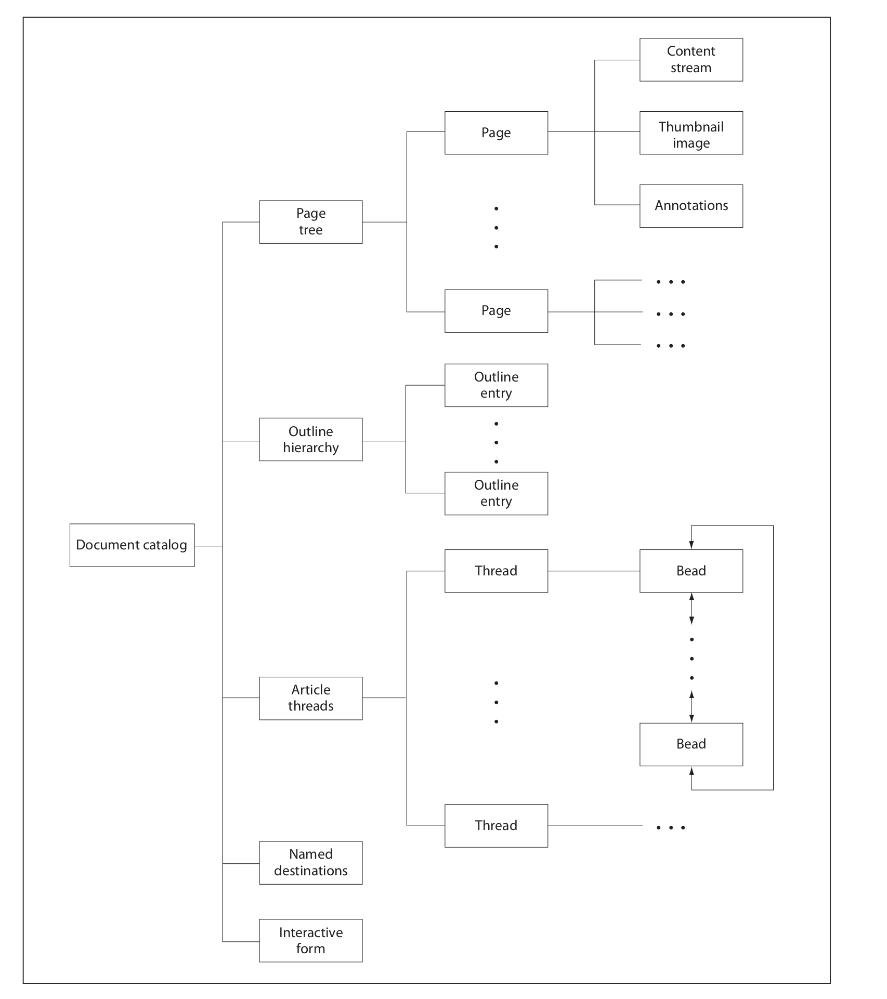

+++
title = "Write a PDF Library(一): Overview"
description = "PDF Spec Overview"
date = 2024-01-02
updated = 2024-01-02
draft = false

[taxonomies]
tags = ["PDF"]
[extra]
math = true
math_auto_render = true
keywords = "PDF"
toc = true
series = "PDF"
+++

  PDF(Portable Document Format) 有很长的历史,最早是从 Postscript 语言脱胎出来的。之所以对 PDF 感兴趣是因为 PDF 很常见, 但是 PDF 中的数据利用起来会比较有难。对于普通用户, PDF 的特性不适合修改, 增,删,查,改 基本都不合适，如果是文字最合适的是替换单个字符应该是可以的。 对于开发者，要从 PDF 数据中获取信息就比较困难。比如文档结构化的信息，这些难点体现在 PDF 转 EPUB, Markdown 等格式的时候并不能做到 100% 还原, 标题，段落，表格...等文档结构信息在 PDF 中是不存在的，需要根据 PDF 提前的文本特征做对应的分析，这也导致了在学术界有一个专门研究这个问题的方向 Document Analysis。

其实主要是个人兴趣，想拿 Rust 重写一个 PDF 库。不过我显然低估了这里的难度。PDF 解析和渲染从大的角度看是编译器和图形学的融合。这里整理记录一些自己在读文档和代码之后的总结。

<!-- more -->
## Bird's-eye view
理解 PDF 文件大的角度看可以分四部分:
  - Objects: PDF 文件组成的基本元素。
  - File structure : PDF 的文件是对应到物理存储。
  - Document structure: PDF 文档中有 Page, Catalog 等。
  - Content Stream: 每一页的内容是什么在 Page 的 ContentStream 中定义。

## Objects
- Boolean Objects : 只对应两个关键词
 - true 
 - false
- Numeric Objects: 分 Integer Objects 和 RealObjects, 在写代码的时候应该都能用浮点数表示，而且也分得并不是很清楚
  - Integer Objects: 整数, 
  - RealObjects: 浮点数

- String Objects: 字符串类型分 Literal Strings,和 Hex Strings. 
  - Literal String: 是包含在括号里的 `(literal string content)` , 
  - Hex String 是包含在尖括号里的 `<hex string content>`
- Name Objects: 是以 `/` 开头的字符串

- Array Objects: 数组类型, 一组在中括号里的 Objects, 不分类型。
- Dictionary Objects: 字典类型，Key 一定是 Name Objects, Value 可以是其他任何类型, 字典包含在 `<< >>` 中
- Stream Objects: Stream Objects 包含一个 Dictionary Object 对应这当前 Stream 的一些属性，然后是 stream content 包含在 stream 和 endstream 关键字之间的是 Stream 的内容。image, font 等多用 Stream 来表示.
- Null Object: 对应关键字 null

PDF 标准文档里有 Indirect Objects: 我理解这是一个特殊的对象，严格讲不是 Object 的一部分，是用来给 object 的标识符，用两个整数, 来对 Object 编号，和版本标记。


## File structure
PDF 文件的结构可以分成四个部分，最重要的是 Cross-reference table, Body 部分也重要但是对文件结构来说不展开就不是很复杂。


Header 通常很简单就一行 比如 `%PDF–1. 7`
Trailer 部分是一个 Dictionary, 开始的位置用关键字 `startxref`标记
要解析一个 PDF 文件，第一步是从文件末尾找 startxref 的位置，startxref 之后紧跟的是 Cross-reference table 开始的 offset , 然后定位到这个 offset 解析 Cross-reference table. 

Cross-reference 有两种格式，一种是下面这种, 另一种相对麻烦是存在一个 Stream 里的。这里的 Cross-reference 是有含义的，比如 `xref` 标记 table 的开始。`0 5` 是说对象的编号是 从 0 开始共 5 个。`0000000017 00000 n
` 这里的三部分，第一部分 `0000000017` 是表示 1 这个对象在文件中的 offset, `0000` 可以理解成版本，`n` 和 `f`标记对象是否压缩删除等信息.
```
xref
0 5
0000000003 65535 f
0000000017 00000 n
0000000081 00000 n
0000000000 00007 f
0000000331 00000 n
trailer
<< /Size 22
/Root 2 0 R
/Info 1 0 R
/ID [ < 81b14aafa313db63dbd6f981e49f94f4 >
< 81b14aafa313db63dbd6f981e49f94f4 >
]
>>
```
trailer 是一个 Dictionary 里面保存一些信息，有些是必须的有些是可选的。`/Root` 就是 catalog 的对象, 后面的 `1 0 R ` 就对应 Cross-reference 中的 第 2 个对象的第 0 个版本。这用可以从 Cross-reference table 中获取对象位置，然后解析出来具体内容。所以严格来讲 PDF 是不需要把整个文件都加载到内存的，只需要读取完 Cross-reference table 之后按需读取就好了。

要理解 PDF 文件结构解析出 Body 中的所有 Object，第一步是实现对各种 Objects 的 Parser, 然后读取 Cross-reference table 就完成了。

忽略了一些细节，比如 table 里的第一行是默认的 `655535`, table 能包含的最大数量等等。


## Document structure
 Document 的结构要从 trailer 的 Root 开始，Toot 是 Document catalog 记录了 Page 等信息
 

 Page 从逻辑上是存储在一颗树结构上的，每个叶子节点对应一个 Page, Page 本身是一个 Stream Object 描述的。 每一页直接算是独立的，但当一些属性缺失的时候可能会从父亲节点继承一些属性。

## Content Stream
  这部分就很像 Postscript ，存储的是一些 Operation, 渲染的时候需要写一个基于栈的解释器，并在后面接上图形的接口就可以把 PDF 渲染成图片。这部分应该是最复杂的，会涉及到字体，图形学的一些知识。后面展开。


## note
- [PDF101](https://github.com/angea/PDF101.git) 可以从这里找到一些纯手写 PDF 文件的例子。对理解很有帮助。
- [pdfreference](https://opensource.adobe.com/dc-acrobat-sdk-docs/pdfstandards/pdfreference1.7old.pdf) PDF 标准文档
