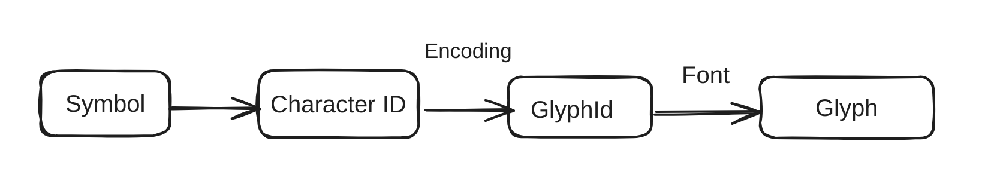

+++
title = "PDF 文件结构-text (六) "
description = "PDF 文件结构"
date = 2024-05-28
updated = 2024-05-28
draft = false

[taxonomies]
tags = ["PDF"]
[extra]
math = true
math_auto_render = true
keywords = "PDF"
toc = true
series = "PDF"
+++

在弄清文本之前需要理解一些概念,Character (字符)或者中文汉字是一种符号，
计算机是先把符号映射成整数，这个编码过程有 Ascii 或 Unicode 编码等。
要把这些符号在屏幕上显示出来，就需要有一种方式来定义这些符号的样子，这个样子的定义我们叫 glyph 可以直接通过光栅化渲染到显示器或者图片里, 给字符(character) 的集合来定义统一风格就组成了字体(Font), 字体又不同的方式，就组成了不同的字体，字体文件也有不同的标准就组成了不同格式的字体比如 OpenType, TrueType 等等。

[](./pdf_text.png)

## Graphics Operation
前面的章节知道了 PDF 所有的内容都是通过 Graphics Operation 来绘制上去的，Text 也不例外,下面就是一个例子, `BT` 表示开始 Text , `ET` 表示 Text 结束, Tf 设置当前字图， Td 定义当前的位置...， Tj 是把一个 PDF String 绘制到页面上的动作。
```
BT
/F13 48 Tf
20 40 Td
0 Tr
0.5 g
( ABC ) Tj
ET
```
这里的内容是只用 Ascii 编码的, 很多时候比如中文里，这个 Tj 前面的符号不一定是 Ascii 或者 Unicode,可以是任何数字，而且通常是 二进制，怎么把这数据解析成当个的 Character Id 然后找到对应的 glyph id 进而找到 glyph ，然后把 glyph 绘制出来，这些都是 Font 中定义的。

理解了上面的过程有些 PDF 的问题就很好理解，比如有些 PDF 文件是可以复制的，但是复制出来是乱码，乱码的意思是我们不能把 PDF 里面 Tj 这个 Operation 参数的 Character Id 映射成具体的 Unicode 或者 Ascii. 
因为我们在 PDF 里面如果不需要搜索字符，只想展示完全可以不需要把 Character Id 到 Unicode 的映射给存起来，虽然 PDF Font 里面有专门的字段 `ToUnicode` 来定义这个问题。如果没有这个映射我们看到的就是乱码.

## Font 
PDF 的 Font 是个极度复杂的话题，简单讲 PDF 里面有两种字体，一种是 Simple Font, 这里面包括 Type1, TrueType, Type3 还有一类是 Composite Font 主要包括 Type0 .

Simple Font 都是用 Tj 的参数中的一个 byte 来表示一个 character id , 然后把 character id 映射到 glyph id. Composite 则是用一个叫 CIDFont 的把 character id 的编码映射到 glyph , 主要是因为中文，日文等，不能用一个 byte 来编码所有字符.

字体可以被嵌入 PDF 文件里，也可以不嵌入，如果不嵌入当 PDF 移动到没有需要字体的机器上就会因为缺少字体而无非显示，或者无法显示一致，因为很多 PDF 阅读器在字体缺失的时候会用默认字体。

如果要从 PDF 文件里抽取出文字，要做的就是 把 `Tj` 或者 `TJ` 两个 Operation 里的参数的 Character 映射成 Unicode ， 如果字体里面没有 ToUnicode 的转化方式，结果就是能看到正常的 PDF ， 但是不能提前文字.

PDF 的字体还有很多细节，涉及很多文字的内容，比如字的大小，阅读方向等。另外一些文档的逻辑结构比如段落，标题，等等在 PDF 里是没有的。
